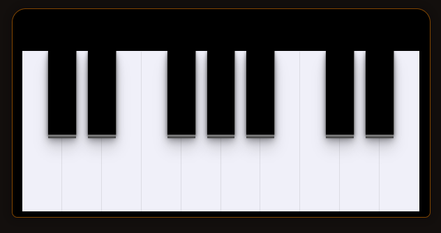

<h1 align="center" style="font-weight: bold;">Web Piano 🎹</h1>

 <a href="#tech">Technologies</a> • 
 <a href="#description">About me</a>  
 

    <b>Project from the RocketSeat's DOM manipulation masterclass</b>

<h2 id="layout">🎨 Layout</h2>

    

<h2 id="technologies">💻 Technologies</h2>

- JavaScrip
- HTML
- SASS

<h2 id="description">📚 About me</h2>

    <b>Well, this is a little simple project I did to learn more about DOM manipulation. This is a simple piano for the web. You can play it with your mouse and your keyboard as well.

The keys for keyboard users are:

A = C | W = C# | S = D | E = D# |D = E | F = F | T = F# | G = G | Y = G# | H = A | U = A# | J = B | K = C | O = C# | L = D | P = D# | Ç = E or ; (for the US)

